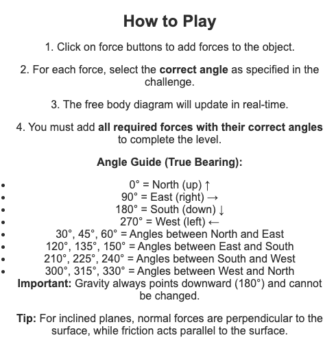
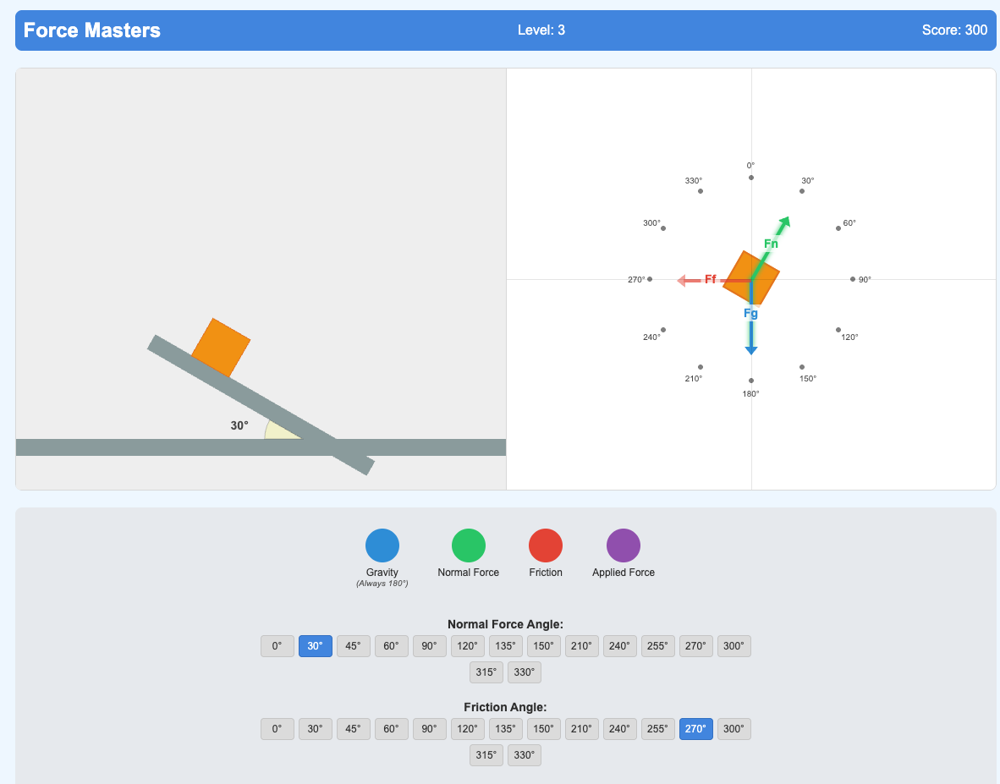
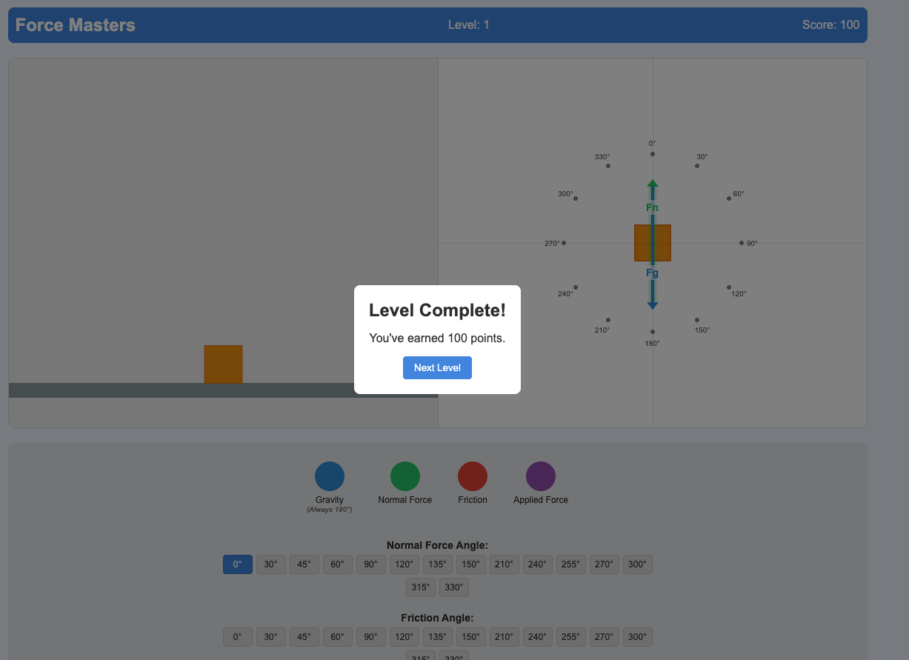
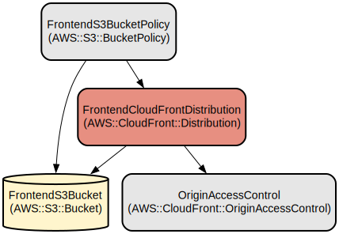

# Force Masters: Interactive Physics Free Body Diagram Learning Game

Force Masters is an educational web application that helps students learn physics concepts through interactive free body diagram creation. The game provides a hands-on environment where users can apply and visualize different forces (gravity, normal force, friction, and applied force) on objects in various scenarios.

The application combines real-time physics simulation using Matter.js with an intuitive user interface to help students understand force interactions. Users progress through levels of increasing complexity, from basic scenarios like objects on flat surfaces to more challenging situations involving inclined planes and multiple forces.

## Repository Structure
```
.
├── deploy.sh                    # AWS deployment script for CloudFormation stack
├── fdb.cmpapp.top/             # Main application directory
│   ├── 404.html                # Custom 404 error page
│   ├── game-angle-functions.js # Force angle calculation and visualization logic
│   ├── game.js                 # Core game mechanics and physics simulation
│   ├── index.html             # Main entry point and UI structure
│   ├── package.json           # Node.js project configuration
│   ├── server.js              # Development HTTP server
│   └── styles.css            # Application styling
└── prd-fbd-game-template.yaml  # AWS CloudFormation infrastructure template
```

## How to Play


## Game Screenshots



## Usage Instructions
### Prerequisites
- Modern web browser with JavaScript enabled
- Node.js (for local development)
- AWS CLI (for deployment)

For deployment:
- AWS account with appropriate permissions
- ACM certificate for the domain
- Domain name configured in Route 53

### Installation

#### Local Development
1. Clone the repository
```bash
git clone [repository-url]
cd [repository-name]
```

2. Install dependencies
```bash
cd fdb.cmpapp.top
npm install
```

3. Start the development server
```bash
npm start
```

#### Production Deployment
1. Configure AWS CLI with appropriate credentials

2. Deploy the infrastructure
```bash
./deploy.sh
```

### Quick Start
1. Open the application in a web browser
2. Select a force type from the control panel (gravity, normal force, friction, or applied force)
3. Choose the appropriate angle for the selected force
4. Complete the challenge by applying all required forces with correct angles

### More Detailed Examples
1. Basic Scenario - Box on Flat Surface:
   - Add gravity (180°)
   - Add normal force (90°)
   - Verify forces balance in the free body diagram

2. Inclined Plane:
   - Add gravity (180°)
   - Add normal force perpendicular to the incline
   - Add friction parallel to the incline
   - Observe force components and their interactions

### Troubleshooting
1. Forces not appearing:
   - Verify force selection in the control panel
   - Check if angle is selected for the force
   - Refresh the page if physics simulation stops responding

2. Performance Issues:
   - Clear browser cache
   - Disable browser extensions
   - Check for console errors (F12 Developer Tools)

3. Deployment Issues:
   - Verify AWS credentials are configured
   - Check CloudFormation stack events for errors
   - Ensure S3 bucket name matches domain name
   - Verify ACM certificate is valid and in us-east-1 region

## Data Flow
The application follows a straightforward data flow for physics simulation and force visualization.

```ascii
[User Input] -> [Force Selection] -> [Angle Selection]
      |               |                    |
      v               v                    v
[Game State] -> [Physics Engine] -> [Force Calculations]
                      |                    |
                      v                    v
              [Visual Rendering] <- [FBD Generation]
```

Component interactions:
1. User selects forces and angles through the control panel
2. Game state updates with new force configurations
3. Matter.js physics engine processes force interactions
4. Force calculations determine object behavior
5. Visual renderer updates the physics world display
6. Free Body Diagram (FBD) updates to reflect current forces
7. Force status panel validates force configurations
8. Level completion check evaluates solution correctness

## Infrastructure


AWS resources created by CloudFormation template:

### S3
- FrontendS3Bucket: Hosts static website content
- BucketPolicy: Restricts access to CloudFront

### CloudFront
- Distribution: Serves website content globally
- Origin Access Control: Secures S3 bucket access
- SSL/TLS: Uses ACM certificate for HTTPS
- Custom domain: Configured with provided domain name

### Security
- Public access blocked on S3 bucket
- HTTPS-only access via CloudFront
- TLS 1.2 minimum protocol version
- Origin Access Control for S3 protection

## Lessons Learnt
I chose this game as one of my STEM teacher friend has discovered her junior students facing difficulties in understanding abstract physic concepts, such as free body diagrams. As such, I created this game to enable students to understand such concepts easier with a gamified learning approach.

Throughout the conversation with Amazon Q, i find the following faciliates effective prompting:
- Define a prompting framework such that the AI know the context, the task, and the expected results
- Ask AI to provide visual debugs can let the AI know how to fix issues more quickly
- Ask AI to give a plan before coding
  
